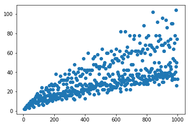

```python
def findSummands(primeNumbers, results):
    findValue = 6
    summand1 = 0
    summand2 = 0
    while findValue < 1000:
        i=0
        while i<len(primeNumbers)-1:
            c=0
            #iterate over first summand
            summand1 = primeNumbers[i]
            while c<len(primeNumbers)-1:
            #iterate over second summand
                summand2 = primeNumbers[c]
                #print summand2
                #print summand1
                if summand1 + summand2 == findValue:
                    #declare list and append to dict
                    summands = [summand1,summand2]
                    l = results.get(6)
                    #print l
                    results[findValue].append(summands)
                    #results.update({findValue:[summands]})
                    #z is the even number; i is the number(count) of entry ; c[0] is first summand, c[1] second summand    
                c+=1
            i+=1
        findValue = findValue+2
    return results
```


```python
import random
import os
import numpy as np
from collections import defaultdict
from primesieve import *
from primesieve.numpy import *
import random
import sys
import array
import matplotlib.pyplot as plt

primeNumbers = n_primes(1000)
#print last Prime
print (primeNumbers[999])
results = {}
results = defaultdict(list)
results.update({6:[()]})
findSummands(primeNumbers, results)
#print results
print ("debug2")
print (results.get(16))
print (len(results.get(16)))
```

    7919
    debug2
    [[3, 13], [5, 11], [11, 5], [13, 3]]
    4
    


```python
#iterate over dictionary and save in new coordinate arrays
x = []
y = []
for key,val in results.items():
    x.append(key)
    y.append(len(results.get(key)))

print (x[5])
print (y[5])

#plot graph   
plt.scatter(x, y)
plt.show()
```

    16
    4
    




